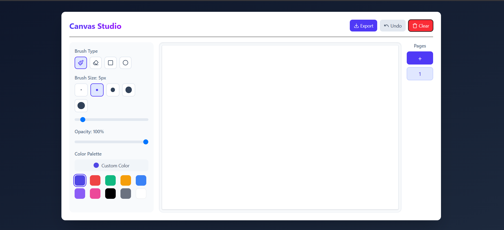

# Canvas Studio - Interactive Drawing Application

Canvas Studio is a modern, feature-rich drawing application built with React and TypeScript. It provides an intuitive interface for digital sketching with multiple tools, color options, and multi-page support.

🔗 **Live Demo:** [canvas-studio-pk.vercel.app](https://canvas-studio-pk.vercel.app/)



## ✨ Features

- 🖌️ Multiple drawing tools:
  - Pencil for freehand drawing
  - Eraser for corrections
  - Shape tools (rectangle and circle)
- 🎨 Advanced color selection:
  - Predefined color palette
  - Custom color picker
- 📐 Adjustable brush sizes and opacity
- 📄 Multi-page canvas support
- ↩️ Undo functionality
- 🗑️ Clear canvas option
- 💾 Export drawings as PNG
- 📱 Responsive design for desktop and mobile

## 📚 What I Learned

- Learned to use **react-color** for color picking and **react-canvas-draw** for canvas interactions.
- Gained deeper understanding of the **HTML5 Canvas API**.
- Explored how to manage dynamic multi-page drawing states using React.
- Handled styling with TailwindCSS and added transitions for a smooth UI/UX.

## 🚀 Getting Started

### Prerequisites

- Node.js (v14.0.0 or later)
- npm or yarn

### Installation

1. Clone the repository:
   ```bash
   git clone https://github.com/Pratham2703005/Canvas-studio
   cd Canvas-studio
